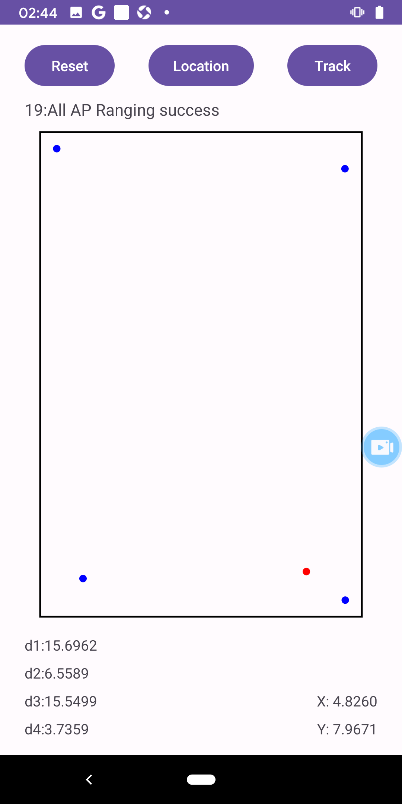

# FTM_Localization

> SUSTech Wireless Network and Mobile Computing Project  
> (c) 2024 HuaCL Zhao.K.J

## Basic Functions

### Location-Based on ToF with FTM-Supported Devices

1. Press Reset to clear all information.
2. Press Location for a single positioning (positioning after 20 RTT measurements).
3. Press Track to start continuous positioning (tracking).

### Related Prompt Information

1. Prompt Bar: Located in the top left corner, indicating the current measurement status.
2. AP Information: Located in the bottom left corner, displaying the distance to the 4 nearest APs (after calibration).
3. Position Information: Located in the bottom right corner, displaying the current position.
4. Schematic Plan:
    1. Black frame represents the room.
    2. Blue dots represent APs.
    3. Red dot represents the location.

### Program Screenshots

## Usage Instructions

### Dependencies

1. Android API Level 28+
2. Android Support Repository
3. Android phones supporting WifiRttManager  
   For more information, see:  
   <https://developer.android.com/reference/android/net/wifi/rtt/WifiRttManager>

### Running the Code

This app uses the Gradle build system. To build this project, use the "gradlew build" command or use "Import Project" in Android Studio.  
The code is available at Github: <https://github.com/HUA428571/FTM_Localization>
You need to appropriately set the room and AP positions before running the program (these settings can be found in \app\src\main\res\values\location.xml).

## Brief Code Explanation

### MainActivity.java

In this activity, we uses Wi-Fi Round-Trip Time (RTT) for indoor positioning. It calculates the device's position by measuring the distance to nearby Wi-Fi Access Points (APs). The application includes Wi-Fi RTT capability detection, AP scanning, position calculation, and user interface interaction. Key features include dynamically loading AP and room configuration from XML resources, processing Wi-Fi RTT ranging results, and displaying this information on the user interface.  

**Key Functions**

1. **`startScanAP()`**: This function initiates a Wi-Fi scan to find nearby APs. It checks for location permissions and uses the `WifiManager`'s `startScan()` method. The scan results are stored in the `scanResults` list.

2. **`startFTMRanging_Track()` and `startFTMRanging_MultiRequest()`**: These functions initiate RTT ranging. They build `RangingRequest` objects and start ranging requests through `WifiRttManager`. They handle both single and multiple ranging requests.

3. **`getCoordinates()` and `getCoordinates_Track()`**: These functions calculate the device's position using the least squares method. They compute the average distances from the device to each AP using ranging results and use these distances along with the APs' location information to estimate the device's coordinates.

4. **`RttRangingResultCallback` and `RttRangingResultCallback_Multi` Classes**: These inner classes handle the results of Wi-Fi RTT ranging. They override the `onRangingFailure` and `onRangingResults` methods to handle cases of ranging failure and success.

5. **`importAPLocation()`**: This function imports AP location and calibration data from XML resource files, allowing the application to adjust parameters dynamically based on the configuration file.

These functionalities work together to enable the application to effectively use Wi-Fi RTT technology for indoor positioning, providing real-time location information to users.

### LocationPermissionRequestActivity.java

Requesting location information is a prerequisite for conducting AP scanning and subsequent operations.

### LocationView.java

This code defines a custom `View` class named `LocationView` in an Android application. It is designed to display the positioning points and Access Points (APs) in an indoor environment. The key components and their functionalities are as follows:

- **Paint Objects**: Utilizes `Paint` objects for drawing. There are separate paint objects for general drawing (`paint`), drawing APs (`apPaint`), and drawing the location point (`locationPaint`).

- **Room and AP Positions**: Stores the dimensions of the room (`roomLength`, `roomWidth`) and the positions of APs (`apPositions` array).

- **Location Coordinates**: Maintains the current location coordinates (`x`, `y`). These are initialized to an off-screen position.

- **Scaling and Offsets**: Calculates the scale factor and offsets (`offsetX`, `offsetY`) to proportionally fit the room within the device's screen, keeping the drawing centered.

- **Initialization**: In the constructor (`LocationView(Context context, AttributeSet attrs)`), it calls `initLocationView()` to initialize the paint objects.

- **Setting Methods**: Includes methods to set the room size (`setRoomSize(float length, float width)`), AP positions (`setApPositions(float[][] positions)`), and location (`setLocation(float positionX, float positionY)`). These methods also call `invalidate()` to trigger a redraw of the view.

- **Drawing Logic**: Overrides the `onDraw(Canvas canvas)` method to draw the room outline, APs, and the current location. The drawing accounts for the calculated scale and offsets.  

### TFLiteModel.java

This code defines a class `TFLiteModel` to integrate a TensorFlow Lite (TFLite) model for machine learning inference in an Android application. The class encapsulates the model loading and inference process. Key components and their functionalities are:

- **TensorFlow Lite Interpreter**: `Interpreter tflite` is an instance of the TFLite Interpreter, responsible for running the machine learning model.

- **Model Loading**: The `loadModelFile` method loads a TFLite model from the app's assets. It opens a file descriptor for `dense_model.tflite` and maps it into memory.

- **Constructor**: The constructor (`public TFLiteModel(Context context)`) initializes the `Interpreter` with the loaded model.

- **Normalization**: Mean (`mean`) and standard deviation (`std`) arrays are defined for normalizing the input data to the model.

- **Inference Method (`runInference`)**: This method takes input data, normalizes it, runs the model inference, and returns the output. The normalization is performed by subtracting the mean and dividing by the standard deviation.
